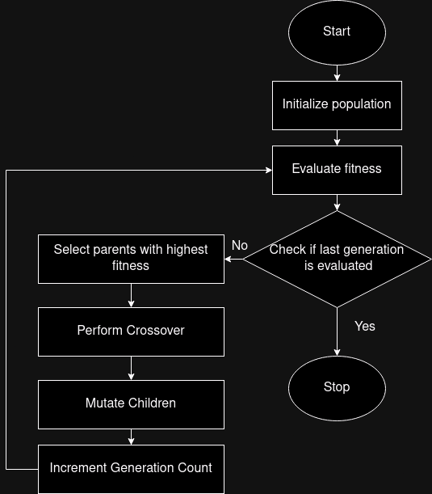
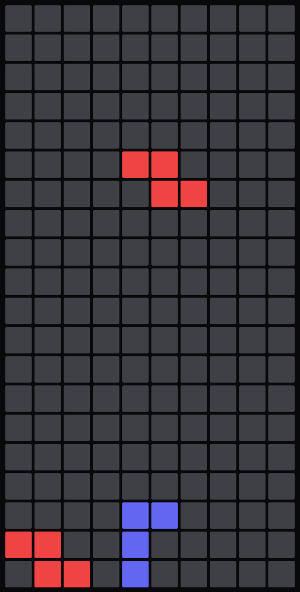
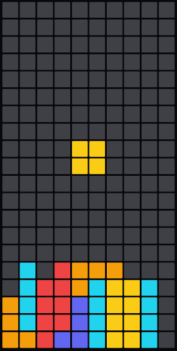
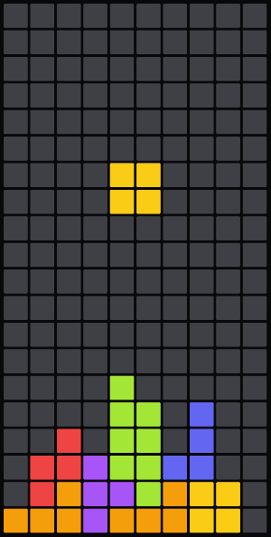

# tetris-ai

AI that plays tetris, trained using [genetic algorithm](https://en.wikipedia.org/wiki/Genetic_algorithm) in C.
<br />
<br />
Genetic algorithm (GA) is a metaheuristic inspired by the process of natural selection that belongs to the larger class of evolutionary algorithms.

## Demo

https://github.com/user-attachments/assets/d16feb4f-c829-4afb-b151-e69c9be16164

## Building (Linux)

- Download [Docker](https://www.docker.com/)

- Clone the repository

```bash
git clone https://github.com/nishantHolla/tetris-ai
cd tetris-ai
```

- Run the `build.sh` script to build the Docker image

```bash
./build.sh release
```

- Run the `run.sh` script to run the Docker image

```bash
./run.sh
```

- If you want to play the game insted of the AI, run the executable with the `--no-ai` flag

```bash
./run.sh --no-ai
```

- If you want to run the genetic algorithm with custom parameters, create a file called `tetris-ai-train-params.txt`
in the root directory with the following numbers separated by space in the first line
    - generation_count (positive integer): Number of generations to train
    - population_size (positive intenger): Size of the population to train
    - games_per_chromosome (positive integer): Number of games to play for each chromosome in the population
    - moves_per_game (positive integer): Maximum number of moves each game should be played for
    - elitism_rate (decimal between 0 and 1): Percentage of the population to be carried over to the next generation
    - mutation_rate (deciaml between 0 and 1): Percentage of population to be mutated in each generation<br />
For example:
```bash
100 100 10 5000 0.2 0.4
```
Then build and run with the `--train` flag
```bash
./build.sh release
./run.sh --train
```
Once the training is complete, you will see two new files in the root directory: `tetris-ai-train.log` (which is
the log file of each generation) and `tetris-ai-params.txt` which contains the weights of the best chromosome.<br />
Build and run the executable like before to use the new weights

- To see the help message run
```bash
./run.sh --help
```

## About Genetic Algorithm

Genetic algorithm is a nature inspired optimization technique that starts off with a set of  possible
solutions selected randomly from the entire solution space to a problem called `population`. Each
solution is called a `chromosome` that has parameters called `genes` that affect the validity of
the solution to the problem.<br />
<br />
Each `chromosome` is tested with its `gene` and a `fitness` value is assigned to it using a defined
`fitness function`. The `fitness` of the `chromosome` tells how good the solution is to the problem.<br />
<br />
`chromosomes` with higher `fitness` are `selected` for the next `generation` and have higher chance
of producing `offspring` i.e. new `chromosomes` that replace the `chromosomes` with low `fitness`.<br />
<br/>
`crossover` is performed between randomly selected `chromosomes` where in the genes of the two `chromosomes`
are swapped starting from a single (or double) point.<br />
<br />
Some of the `chromosomes` are mutated by changing the values of their `genes` to introduce new
solutions to the population.<br />
<br />
This process is continued many times in the name of `generations` to approximate a good solution
to the problem<br />
<br />
<br />


## Parameters used

The folowing parameters are calculated by the AI to decide the placement of the piece:

### Number of holes

A hole is defined as an empty cell which has at least one non empty cells above it. Holes are
considered to be bad as it does not allow lines to be completed easily. Some holes are even worse
such as holes in the first and last column as filling them in the upcoming moves is even harder compared
to holes in any other columns. For this reason holes in the first and last column are counted twice
to differentiate them from other holes.<br />
For example, the below board has 4 holes.<br /><br />

<br />

### Bumpiness of the surface

The bumpiness of the surface of a board is defined as the sum of absolute difference of heights of
adjacent columns. Bumpiness is bad as it makes placement of upcoming pieces more difficult.<br />
For example, the below board has a bumpiness of 9.<br /><br />

<br />

### Height

The height of the board is defined as the height of the heights column present in the game. Higher
height is bad as it makes it difficult to place upcoming pieces.<br />
For example, the below board has a height of 6.<br /><br />

<br />

### Lines cleared

As the goal of the game suggests, a move that clears a line is considered to be better than a move
that does not clear a line.<br />

### Score of a move

The final score of a move is the sum of the above mentioned parameters multiplied by its weight that
is determined by genetic algorithm. The move with highest score is selected to be played.

## Scoring system

The following scoring system is adopted in this implementation of tetris
- 1 line cleared: 100 points
- 2 line cleared: 300 points
- 3 line cleared: 500 points
- 4 line cleared: 800 points
