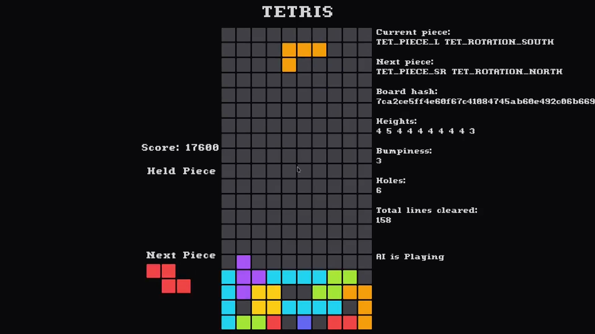

# tetris-ai

AI that plays tetris, trained using [genetic algorithm](https://en.wikipedia.org/wiki/Genetic_algorithm) in C.
<br />
<br />
Genetic algorithm (GA) is a metaheuristic inspired by the process of natural selection that belongs to the larger class of evolutionary algorithms.

## Demo

[](https://vimeo.com/1052779149?share=copy)
Click the image to view demo video

## Building (Linux and MacOS)

- Clone the repository

```bash
https://github.com/nishantHolla/tetris-ai
cd tetris-ai
```

- Run make

```bash
make release
```

- Execute the program

```bash
cd out
./tetris-ai
```

- If you want to play the game insted of the AI, run the executable with the `--no-ai` flag

```bash
./tetris-ai --no-ai
```

- If you want to run the genetic algorithm with custom parameters, create a file called `tetris-ai-train-params.txt`
in the directory of the executable with the following numbers separated by space in the first line
    - generation_count (positive integer): Number of generations to train
    - population_size (positive intenger): Size of the population to train
    - games_per_chromosome (positive integer): Number of games to play for each chromosome in the population
    - moves_per_game (positive integer): Maximum number of moves each game should be played for
    - elitism_rate (decimal between 0 and 1): Percentage of the population to be carried over to the next generation
    - mutation_rate (deciaml between 0 and 1): Percentage of population to be mutated in each generation<br />
For example
```bash
100 100 10 5000 0.2 0.4
```
Then run
```bash
./tetris-ai --train
```
Once the training is complete, you will see two new files in the current directory: `tetris-ai-train-<timestamp>.log` (which is
the log file of each generation) and `tetris-ai-params.txt` which contains the weights of the best chromosome.<br />
Run the executable like before to use the new weights

- To see the help message run
```bash
./tetris-ai --help
```
